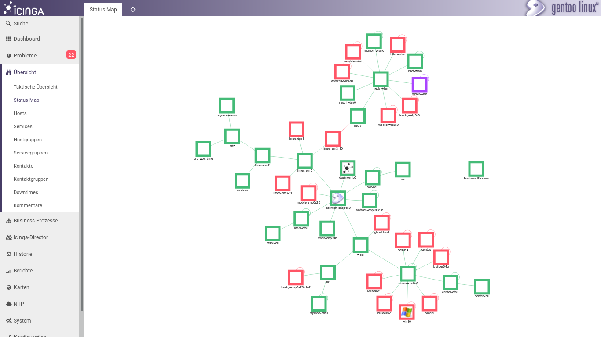
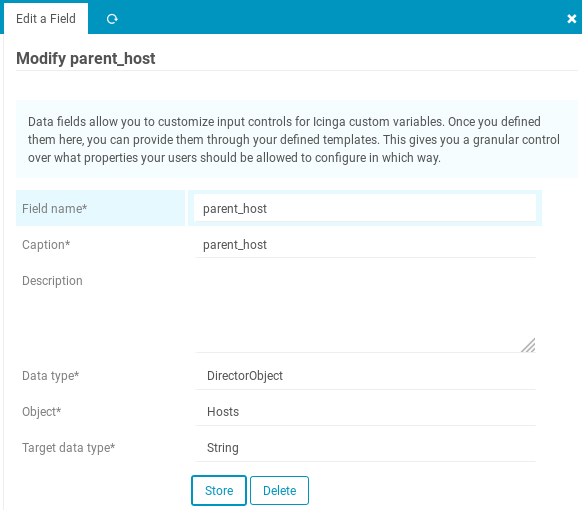
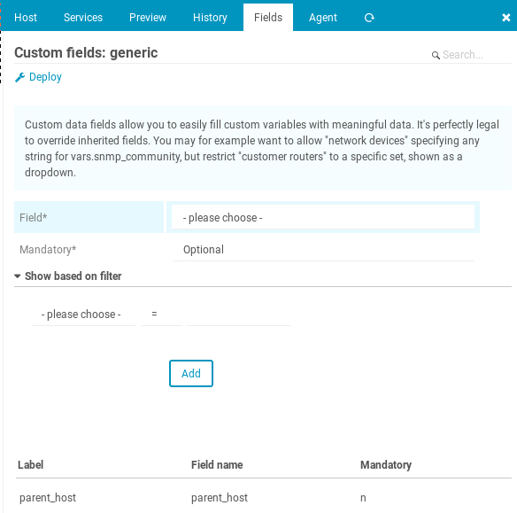
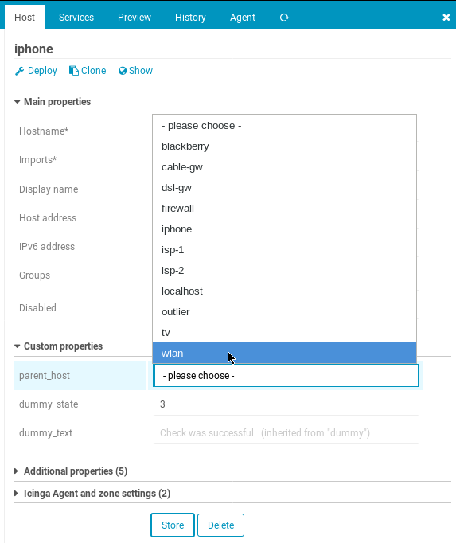
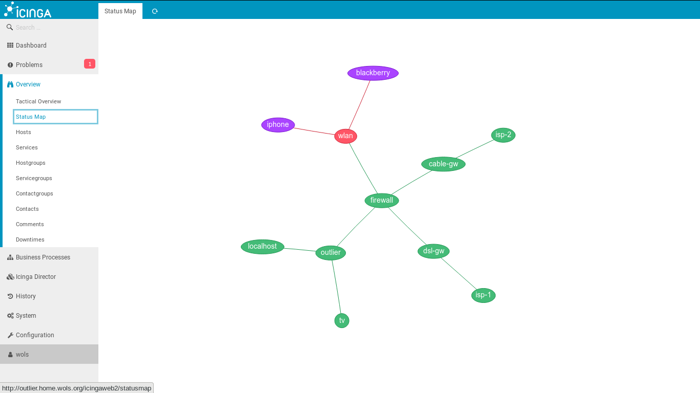

# icingaweb2-module-statusmap

This is a host status map module for Icingaweb 2.



Only any `icon_image` are set.

## Installation

To install, check out this repo to your icingaweb2 modules directory:

```bash
git clone https://github.com/invliD/icingaweb2-module-statusmap.git /usr/share/icingaweb2/modules/statusmap
```

In addition, the monitoring module does not contain an IDO model class and a DataView, so you need to link those files into that module:

```bash
cd /usr/share/icingaweb2/modules/monitoring/library/Monitoring/Backend/Ido/Query
ln -s ../../../../../../statusmap/library/Monitoring/Backend/Ido/Query/HostdependencyQuery.php

cd /usr/share/icingaweb2/modules/monitoring/library/Monitoring/DataView
ln -s ../../../../statusmap/library/Monitoring/DataView/Hostdependency.php
```

## Usage

### Apply rule

```
# /etc/icinga2/conf.d/dependencies.conf

apply Dependency "depend-host-parent_host" to Host {
    parent_host_name = host.vars.parent_host

    assign where host.vars.parent_host
}
```

### Icinga Web 2 Module Director

1. Add data field

- Field name: `parent_host`
- Caption: `parent_host`
- Description:
- Data type: `DirectorObject`
- Object: `Hosts`
- Target data type: `String`



2. Add field to host template



3. Set host property `parent_host`



### Example

```
localhost                   UP
└── outlier                 UP
    ├── firewall            UP
    │   ├── cable-gw        UP
    │   │   └── isp-2       UP
    │   ├── dsl-gw          UP
    │   │   └── isp-1       UP
    │   └── wlan            DOWN
    │       ├── blackberry  UNREACHABLE
    │       └── iphone      UNREACHABLE
    └── tv                  UP
```



## Contributing

If you want to contribute to this project:

- Fork the repository
- Hack your changes
- Submit a Pull Request

## License

This project is licensed under the GNU GPLv2. See [COPYING](COPYING.md) for the full license text.
